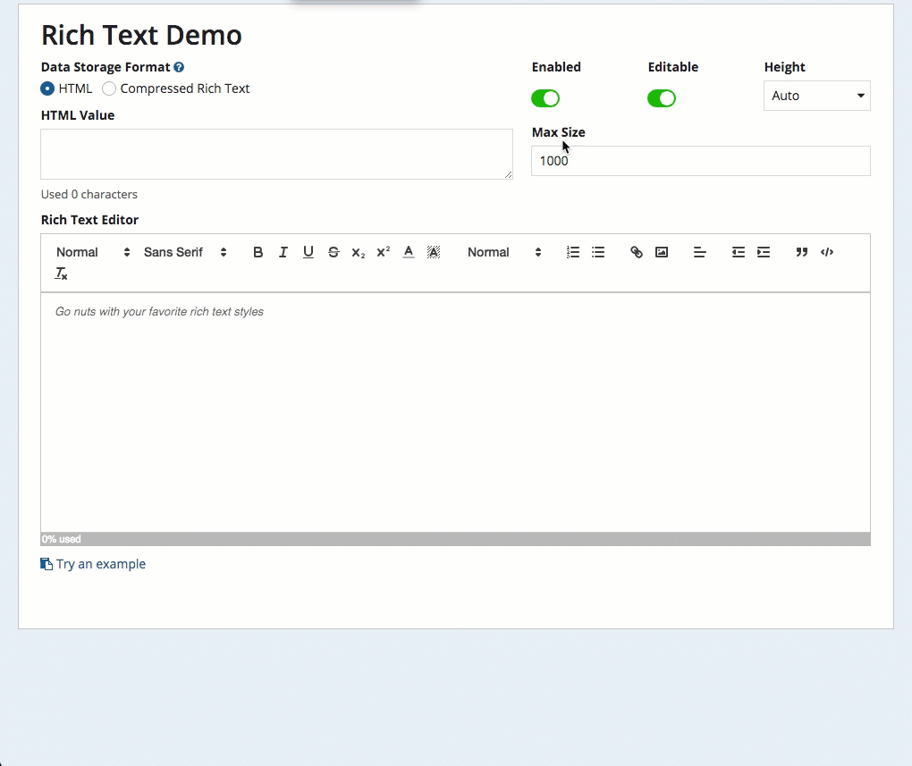

# Rich Text Editor Component Plug-in



## How to Use

**Function**: `fn!richTextField`

Displays a field that allows entry of formatted ("rich") text.

**Parameters**

| **Name**          | **Keyword**       | **Type**   | **Description**                                                                                                                                                                       |
| ----------------- | ----------------- | ---------- | ------------------------------------------------------------------------------------------------------------------------------------------------------------------------------------- |
| Label             | label             | Text       | Optional text to display as the field label.                                                                                                                                          |
| Label Position    | labelPosition     | Text       | Optional text to determine where the label appears.                                                                                                                                   |
| Read-only         | readOnly          | Boolean    | If set to true, prohibits users from editing the value. Default is false.                                                                                                             |
| Instructions      | instructions      | Text       | Optional text to display below the field's value.                                                                                                                                     |
| Disabled          | disabled          | Boolean    | Determines if the user is prevented from changing the value. Default is false.                                                                                                        |
| Validations       | validations       | Text Array | Validation errors to be displayed below the field when the value is not null.                                                                                                         |
| Validation Group  | validationGroup   | Text       | When present, this field is only validated when a button in the same validation group is clicked.                                                                                     |
| Display Value     | richTextValue     | Text       | The value to display in the Rich Text Editor field. Supports HTML or compressed output from Rich Text Editor field.                                                                   |
| Save Input To     | richTextSaveInto  | Save Array | One or more variables that are updated with the text when the user changes it. Use a!save() to save a modified or alternative value to a variable.                                    |
| Height            | height            | Text       | Determines the field height. Valid values include "SHORT", "MEDIUM" (default), and "TALL".                                                                                            |
| Placeholder       | placeholder       | Text       | Optional text to display in the field when it is empty. Does not show if the field is read only.                                                                                      |
| Maximum Size      | maxSize           | Integer    | Maximum allowed size for the rich text data. If not specified, will automatically limit data to 10,000.                                                                               |
| Show Progress Bar | enableProgressBar | Boolean    | Whether to show a progress bar at the bottom of the component to let users know how much of the maximum allowed data size they have entered                                           |
| Allowed Formats   | allowedFormats    | Text Array | Determines which rich text formats are allowed. Valid values are: "header", "size", "bold", "italic", "underline", "strike", "color", "background", "link", "align", "indent", "list" |

### Example

```
fn!richTextField(
  label: "Rich Text Field",
  labelPosition: "ABOVE",
  disabled: fn!false(),
  validations: {},
  height: "MEDIUM",
  richTextValue: ri!value,
  richTextSaveInto: ri!value,
  readOnly: fn!false(),
  maxSize: 1024,
  placeholder: "Go nuts with your favorite rich text styles",
  useCompression: fn!false(),
  enableProgressBar: fn!true(),
  allowedFormats: {"size", "bold", "italic", "underline", "strike", "color", "background"}
)
```

## Technical Details

Uses the [Quill](https://quilljs.com/) rich text editor library.

Import the `Rich Text App.zip` to test the component.

Use the [sail-tools](https://www.npmjs.com/package/sail-tools) CLI to modify and package the component.

For more information on Component Plug-ins, see the [Component Plug-in Developer’s Guide Preview
](https://docs.google.com/document/d/1QWYZUWb-gG1I5AKeRF6saKUaLwUk2mIndQ6zkGZaU4o/edit#).
